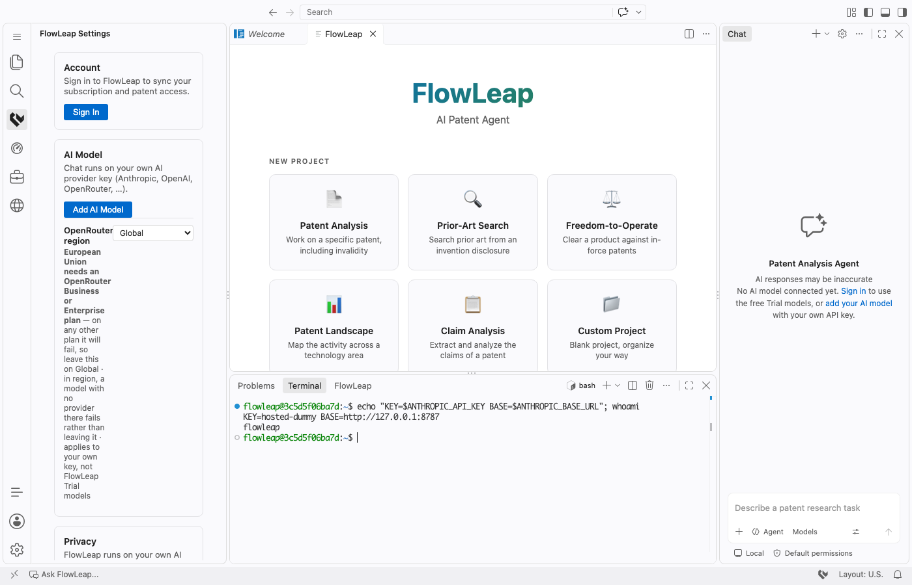

# Hosted Workspace: one VM per user

ADR 0011, PRD 0019, #507. This is how to set up a **Hosted Workspace** for one invited user on
one Ubuntu 24.04 VM, and how to remove it. The scripts are in `scripts/hosted/`. A built
package also has a copy of them in its `hosted/` folder.

## What runs on the VM

| Part | Listens on | User | Holds |
|---|---|---|---|
| nginx | `:80` (ACME and a redirect only), `:443` | `www-data` | TLS cert. It asks the backend about every request (`auth_request` to `/v1/hosted/authorize`). |
| `flowleap-server` (systemd) | `127.0.0.1:8000` | `flowleap` | The reh-web server, the extension host, the agent host, the pty host. Environment: `/etc/flowleap/server.env` (no secrets). |
| `flowleap-anthropic-proxy` (systemd) | `127.0.0.1:8787` | `flowleap-proxy` | The real Anthropic key. It is in `/etc/flowleap/anthropic-proxy.env` (root, 0600). |

The server has `ANTHROPIC_BASE_URL=http://127.0.0.1:8787` and `ANTHROPIC_API_KEY=hosted-dummy`.
The browser terminal is a child of the server, so `echo $ANTHROPIC_API_KEY` in it prints
`hosted-dummy`. The proxy removes the caller's credentials and adds the real `x-api-key`.



Sign-in to the workspace (the gate in nginx):

1. A request without a valid FlowLeap Session gets `401` from the backend. nginx then sends the
   browser to `https://api.flowleap.co/oauth/authorize?client_id=patent-ai-agent&redirect_uri=https://<name>.app.flowleap.co/_flowleap/callback&state=<id>`.
   The `state` is also put in an HttpOnly cookie.
2. The user signs in on the website. The website returns to `/_flowleap/callback` with `token`,
   `state` and `expires_in`.
3. nginx compares `state` with the cookie and keeps the token in the HttpOnly cookie
   `fl_hosted` (30 days). Then it sends the browser to `/`.
4. On each request, nginx sends `fl_hosted` to the backend as `Authorization: Bearer`:
   `204` lets the request through, `403` shows "not invited".

**One sign-in (#548).** The same token also signs in the Patent Agent sidebar, so the user
does not sign in a second time:

5. When the Patent Agent extension starts with no FlowLeap session (or the user clicks Sign In),
   it runs the core command `_flowleap.hostedGateSession`. That command runs in the browser,
   only when the server has `--hosted-user-data`. It sends
   `GET /_flowleap/session` with `X-FlowLeap-Hosted: 1` on the same origin.
6. nginx answers `{"token":"<fl_hosted>"}` with `Cache-Control: no-store`, only if all of
   these are true: the header is there; `Sec-Fetch-Site` is absent or `same-origin`; the
   `fl_hosted` cookie is there; and `auth_request` lets it through (an allowlisted session).
   Otherwise: `403` (header or cross-site), `401` (no cookie, or the backend refused the token).
7. The extension keeps the token in its secret storage, which on a Hosted Workspace is
   `data/User/secrets.json` on the VM (#547). The expiry is the token's `exp` claim.

Threat model of `/_flowleap/session`:

- The answer is the token that this browser already holds in `fl_hosted`. The endpoint gives
  it to no one who does not already send it in the cookie. It moves the token from the HttpOnly
  cookie into the app's secret store on the server; the web client keeps it only in memory
  while it passes it to the extension, never in `localStorage` or IndexedDB.
- A page on another site cannot read it. The browser does not send the `SameSite=Lax` cookie
  with a cross-site `fetch`; the custom header forces a CORS preflight, which nginx refuses
  (`403`) and which carries no `Access-Control-Allow-*` headers; and a request whose
  `Sec-Fetch-Site` is `cross-site` or `same-site` gets `403` even with a cookie. `same-site`
  matters: another `*.app.flowleap.co` workspace is same-site, not same-origin.
- Any script that runs on this origin (the workbench, and through it the user's own terminal
  and extensions) can read the token. That is the same trust as before: that code already acts
  as the user through the gate cookie, and the user can read `secrets.json` on the VM.
- The extension pulls the token; nothing pushes a token into it. The deep-link callback still
  needs the CSRF `state` of a sign-in that this extension started, so no link can sign the user
  in to someone else's account.
- Sign out in the sidebar is kept: after it, the next load does not use the gate token again
  until the user clicks Sign In. The gate cookie itself stays until it expires (30 days).
- Known limit, not new: another workspace on `*.app.flowleap.co` could set an `fl_hosted`
  cookie for the parent domain (cookie tossing). The gate then checks that token, and this
  endpoint would return it. Both are covered by the "allowlist is not ownership" limit below.

We do not use the website's Clerk `__session` cookie. It expires in about one minute. nginx
does **not** forward any browser cookie to the backend (#542). Clerk sets client cookies on the
root domain `flowleap.co`, so the browser sends them to `*.app.flowleap.co` too. If nginx
forwarded them, Clerk's middleware would answer the auth call with a `307` handshake redirect,
and `auth_request` turns that into a `500`. The auth call also sends `Accept: application/json`
and blank `Sec-Fetch-*`, `Origin` and `Referer` headers. The backend runbook text that says "forward the Cookie header"
is wrong for this setup (flowleap-backend issue filed from #542).

**No auth cache (decision, #542).** The first version cached `204`/`403` answers for 30 seconds
(`proxy_cache hosted_auth`). On the first VM, `GET /` passed, then the next asset requests failed
with `auth request unexpected status: 500`. Turning the cache off fixed it. We dropped the
cache: each request makes one backend call, and the route has its own limiter (600 per minute),
which is enough for one user. `verify.sh` checks that consecutive requests with a valid token
all succeed.

**Swap.** `install.sh` adds a 4 GB swapfile (mode 0600, `/etc/fstab`, `vm.swappiness=10`) when
the VM has less than 6 GB RAM and no swap. A 4 GB VM needs it. Running the script again changes
nothing.

Workspace trust: the server starts with `--disable-workspace-trust`. The server then tells
the web client that trust is off, so the folder does not open in Restricted Mode, and
`flowleap.patent-ai` activates on the first load. The VM has one user and one folder, and that
user owns the folder.

## What is stored where

The server starts with `--hosted-user-data` (#547). The web client then keeps the user's data
on the VM, not in the browser. A new browser, a second tab, or a browser that clears its site
data opens the same workspace with the same settings, sign-in and keys. The server data folder
is `/home/flowleap/.flowleap-server/data`.

| Data | Where | Notes |
|---|---|---|
| Workspace files, working records | `/home/flowleap/workspace` | As before. |
| Settings, keybindings, `mcp.json`, `chatLanguageModels.json`, snippets, prompts | `data/User/` | The browser maps `vscode-userdata:/User/…` to this folder through the remote file system. |
| Chat sessions, editing sessions, local history | `data/User/workspaceStorage/<id>/`, `data/User/History/` | |
| Browser state (selected chat model, chat session list, layout, "seen" flags) | `data/User/globalStorage/browserState.json`, `browserState.shared.json`, `data/User/workspaceStorage/<id>/browserState.json` | JSON files. Global and profile state is watched, so a second tab sees changes. Workspace state is per tab, as in a desktop window. |
| Secrets (FlowLeap sign-in, BYOK model keys, EPO/USPTO keys) | `data/User/secrets.json` | One file, AES-256-GCM. The key is `client part XOR server part`. The server part is `/etc/flowleap/hosted-secret.key` (`flowleap`, 0400), which `install.sh` makes once; the browser gets it from `POST /hosted-secret-key`. The secrets file alone cannot be opened. |
| Extension global storage of the server extension host | `data/User/globalStorage/<extension>/` | As before. |
| Logs of the web client | Browser IndexedDB (`vscode-web-db`) | Only logs stay in the browser. |
| The `fl_hosted` gate cookie | Browser | The browser must keep cookies for the host, or it signs in again at the gate. |

Limits: everything a user can read in the browser terminal (they run as `flowleap`) includes
the key and the secrets file; the encryption protects a copy of the data folder, not the running
VM. State that changed in the last five seconds before a tab closes can be lost (the browser
writes state every five seconds). Teardown removes the data folder and the key.

## Before you start (once per workspace)

- The package: `flowleap-server-web-<version>-linux-x64.tar.gz`, from
  `scripts/hosted/build-package.sh <ref> <out-dir>`. Build it on Linux x64 with Node 24.15.0.
  The script header has the `docker run … node:24.15.0-bookworm` command. The build takes about
  one hour under emulation on a Mac and about 15 minutes on a Linux machine.
- The invitee's Clerk user id (`user_…`). It is in the Clerk dashboard, under Users.
- A **new** Anthropic API key, for this workspace only (Anthropic Console → API keys). Give it a
  name such as `hosted-<name>`.

## Ten-minute checklist

1. **VM.** Make an Ubuntu 24.04 x64 VM with 2 vCPU, 4 GB RAM and 30 GB disk or more (install.sh adds swap on a VM with less than 6 GB RAM). Open
   ports 22, 80 and 443. Copy the package to the VM:
   `scp flowleap-server-web-*.tar.gz root@<ip>:/root/`.
2. **DNS.** Add an `A` record `<name>.app.flowleap.co → <VM IPv4>` (if the VM has IPv6, add
   `AAAA` too). Use DNS only, with no proxy: the WebSocket and certbot need the VM directly.
   Wait until `dig +short <name>.app.flowleap.co` returns the IP.
3. **Spend cap.** In the Anthropic Console, set a monthly spend limit on the workspace or
   organization that has this key (Settings → Limits). This is the only brake on inference
   cost in v1 (ADR 0011).
4. **Install.** On the VM:
   ```sh
   tar -xzf flowleap-server-web-*.tar.gz flowleap-server-web-*/hosted
   sudo flowleap-server-web-*/hosted/install.sh <name> /root/flowleap-server-web-<version>-linux-x64.tar.gz <clerk-user-id>
   ```
   It asks for the Anthropic key. The input is hidden. You can also put the key in
   `FLOWLEAP_ANTHROPIC_API_KEY`.
5. **Allowlist.** On the backend host (`ssh flowleap`), add the user id to
   `HOSTED_ALLOWLIST` (comma-separated) in `/opt/flowleap-backend/.env`. Then run
   `docker compose up -d` in `/opt/flowleap-backend`. Do not use `restart`: it does not read
   the env file again.
6. **Verify.** On the VM, run `sudo flowleap-server-web-*/hosted/verify.sh <name>`. All checks
   must pass. The checks: the units run, a signed-out visit goes to sign-in, every process of
   `flowleap` has only the dummy key, `flowleap` cannot read the key file or the proxy's
   environment, an Anthropic call through the proxy gives `200`, workspace trust is off, a bogus Clerk cookie
   still gives the sign-in redirect (never `500`), swap is present, and user data is kept on
   the server (the page has `hostedUserData`, the secrets key is 32 bytes and `flowleap`/0400). With
   `FLOWLEAP_VERIFY_TOKEN=<allowlisted token>` it also checks that three consecutive requests
   do not fail. The single sign-in endpoint must give `403` without its header, `401` without
   a cookie and `403` to a cross-site request; with the token it must give the token, not cached.
7. **Try it yourself first.** Temporarily add your own user id to the allowlist (step 5).
   Open `https://<name>.app.flowleap.co`, sign in, and do these steps:
   - In the terminal, `echo $ANTHROPIC_API_KEY` must print `hosted-dummy`.
   - In the Agents view, start an Agent Session with Claude. It must answer.
   - The FlowLeap sidebar must show you as signed in without a second sign-in (#548), and a
     Patent-data tool call in the editor chat must work.
   - Change a setting and reload. Then open the URL in a private window (or another browser),
     sign in at the gate: the setting and the FlowLeap sign-in must still be there. On the VM,
     `ls /home/flowleap/.flowleap-server/data/User` shows `settings.json` and `secrets.json`.
     The browser console must not log "Using in-memory user data provider".
   - Open a saved report and click a Source anchor (for example `US6265989B1:claims:1:en`).
     The patent reader must open at that claim, after the "Allow … to open this URI?"
     question in the Markdown preview (#549).

   Then remove your id from the allowlist.
8. **Hand-over.** Send the invitee the text below.

### Evaluator hand-over text

> _Placeholder. The founder writes this text. Include: the URL
> `https://<name>.app.flowleap.co`, the account e-mail to sign in with, what the workspace is
> for, the data-handling page (the hosted section), how long the workspace stays, and who to
> contact._

## Update a workspace

Use this to put a new server package on a running VM. User state stays.

```sh
scp flowleap-server-web-<new>-linux-x64.tar.gz{,.sha256} root@<ip>:/root/
ssh root@<ip> sudo flowleap-server-web-<old>/hosted/update.sh /root/flowleap-server-web-<new>-linux-x64.tar.gz
```

`update.sh` does these steps:

1. Compares the SHA-256 of the tarball with the `.sha256` file beside it (only the hash; the
   file names the path in the build container).
2. Unpacks to `/opt/flowleap-server.new` and checks it: `bin/flowleap-server`, `claude-sdk/`,
   and no `"when": "!isWeb"` entry in `extensions/copilot/package.json`.
3. Stops `flowleap-server`, moves the old package to `/opt/flowleap-server.prev` (one
   generation), moves the new one in, and links `/usr/local/bin/flowleap`.
4. Starts the server and waits up to 60 s for `Extension host agent started` in the journal.
5. Runs `verify.sh`.

If a step after the stop fails, the script puts `.prev` back, starts the server, and exits 1.
When it succeeds it prints the installed product path (`oss-<commit>`). The new
package has newer `hosted/` scripts. Run those for the next update.

### What survives an update, a reset, and a reinstall

| Data | Update | Reset | Reinstall (`teardown.sh` then `install.sh`) |
|---|---|---|---|
| Server package `/opt/flowleap-server` | replaced (`.prev` kept) | kept | replaced |
| `/etc/flowleap` (env files, key files, `hosted-secret.key`), Anthropic key | kept | kept | removed, made again |
| nginx vhost, certificate, nginx drop-in | kept | kept | removed, made again |
| `data/User/settings.json`, `browserState*.json`, `secrets.json` | kept | **wiped** | wiped |
| `data/User/workspaceStorage` (chat history) | kept | **wiped** | wiped |
| `data/User/globalStorage` | kept | **wiped**, except `agent-host-*.json`, `agent-host.db`, SDK cache folders | wiped |
| `/home/flowleap/workspace`, `FlowLeap Projects` | kept | **wiped**, empty workspace made | wiped |
| Allowlist entry and the evaluator's 30-day tokens | kept | kept (**you** rotate them) | kept (**you** rotate them) |

## Hand the instance to the next evaluator

The VM is a standing demo instance. One evaluator uses it at a time. Do these steps between two
evaluators:

1. Run `sudo flowleap-server-web-*/hosted/reset.sh <name>` on the VM. It asks you to type the
   name. Use `--yes` to skip the question. It stops the server, wipes the user data and the
   workspace folders (table above), makes the empty workspace, and starts the server. You can
   run it again with the same result.
2. **Rotate the allowlist entry.** On the backend (`ssh flowleap`), in
   `/opt/flowleap-backend/.env`, remove the old Clerk user id from `HOSTED_ALLOWLIST` and add
   the new one. Then run `docker compose up -d` (never `restart`). A password change does
   **not** revoke the 30-day `fl_hosted` and sign-in tokens, so removing the id is the only
   way to lock the previous evaluator out.
3. **One account per evaluator.** Do not share a login. Each evaluator signs in with their own
   Clerk account, so step 2 can remove one person without affecting another.
4. **Rotate BYOK keys.** If the evaluator entered a key on the instance (EPO, USPTO, OpenRouter,
   and so on), rotate it at its provider. `reset.sh` deletes `secrets.json`, but the key was
   readable on the VM while it was in use. Rotate the Anthropic key of the workspace too if it
   was exposed.
5. Run `verify.sh <name>`, then send the next evaluator the hand-over text.

## Keep nginx up (hardening from the 2026-10-06 outage)

`unattended-upgrades` restarted nginx while DNS was briefly down. nginx could not resolve
`api.flowleap.co` at startup ("host not found in upstream") and stayed down from 06:57 to
08:30 UTC. `install.sh` now makes these changes, and `verify.sh` checks them:

- The vhost has `resolver 185.12.64.1 185.12.64.2 1.1.1.1 valid=300s ipv6=off;`, and the gate
  uses `set $flowleap_authorize https://…/v1/hosted/authorize; proxy_pass $flowleap_authorize;`.
  nginx now resolves the name when a request arrives, never at startup.
- A systemd drop-in `/etc/systemd/system/nginx.service.d/flowleap-restart.conf` has
  `Restart=on-failure`, `RestartSec=5s` and `StartLimitIntervalSec=0`.
- Backups of the vhost go to `/etc/flowleap/backup/`. Never leave a `.bak` file in
  `sites-enabled`: nginx loads every file there and warns about "conflicting server name".

**Monitor.** Make an UptimeRobot **KEYWORD** monitor for each hosted host. It checks
`https://<name>.app.flowleap.co/` for the keyword `FlowLeap`, which is on the sign-in redirect
page. (eval1: monitor id 804186095.) A plain HTTP monitor is not enough: a redirect or a
default nginx page can still answer `200`.

## Remove a workspace

```sh
sudo flowleap-server-web-*/hosted/teardown.sh <name>
```

The script stops and removes both units. It removes the vhost and the certificate, the server,
the `flowleap` user with the workspace, and the key file. Then do these steps yourself:

1. **Revoke the Anthropic key** in the Anthropic Console. A copied key works until you revoke
   it.
2. Remove the user id from `HOSTED_ALLOWLIST` and run `docker compose up -d` on the backend.
3. Delete the DNS record. Then delete the VM, or reuse it.

## Known limits (v1)

- **The allowlist admits a user to every Hosted Workspace, not only to their own.**
  `/v1/hosted/authorize` answers "allowlisted or not". It does not answer "the owner of this
  VM". With one invitee this is the same thing. Before a second hosted user, the backend must
  return the user id on `204` (for example `X-FlowLeap-User`). nginx can then compare it with
  `FLOWLEAP_HOSTED_OWNER` in `/etc/flowleap/hosted.env`.
- A hosted user can spend through the proxy from inside their workspace. The spend cap is the
  limit.
- Sign-in through the gate needs backend #552 (`/oauth/authorize` accepts
  `https://<name>.app.flowleap.co/…/callback`) in production. Without it the authorize step
  answers `400 Invalid redirect_uri for this client`.

## Local proof without a VM (what #507 did)

On a Mac, in Docker, without systemd:

```sh
docker run -d --name fl-hosted --platform linux/amd64 --cap-add SYS_PTRACE -p 127.0.0.1:8443:443 \
  -v "$PWD/out:/pkg:ro" -v "$PWD/scripts/hosted:/hosted:ro" ubuntu:24.04 sleep infinity
docker exec -e FLOWLEAP_ANTHROPIC_API_KEY=sk-ant-… -e FLOWLEAP_TLS=self-signed -e FLOWLEAP_INIT=direct \
  fl-hosted bash /hosted/install.sh test /pkg/flowleap-server-web-<v>-linux-x64.tar.gz user_…
docker exec -e FLOWLEAP_VERIFY_LOCAL=1 fl-hosted bash /hosted/verify.sh test
```

How this is different from a VM:

- `FLOWLEAP_INIT=direct`: systemd does not run under amd64 emulation in Docker Desktop (every
  unit exits with 255/EXCEPTION). In this mode, install.sh starts the same two commands, with
  the same users and the same env files, through `setpriv`. The unit files are written and
  checked separately with `systemd-analyze verify`. The sandbox options of the proxy unit
  (`ProtectSystem`, `ProtectHome`, `ProtectProc`) are not tested.
- `FLOWLEAP_TLS=self-signed`: a 30-day self-signed certificate. Certbot is not run.
- `--cap-add SYS_PTRACE`: without it, root in a container cannot read `/proc/<pid>/environ`,
  so verify.sh cannot scan the processes. A VM does not need it.
- To load the workbench through the gate without production sign-in, set
  `FLOWLEAP_AUTHORIZE_URL` to a local stand-in that answers `204`.
